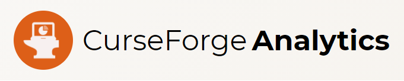

# CurseForge has removed the ability to download your analytics data. This app is now archived.

# Visualize CurseForge Analytics exports from your browser

## Live at [https://antoinegag.github.io/curseforge-analytics-viewer/](https://antoinegag.github.io/curseforge-analytics-viewer/)

## Getting Started

### Prerequisites

Required software

- yarn or npm
- NodeJS

### Installing

Open a terminal at the root of the project

run `yarn` or `npm i` to install the packages

run `yarn start` or `npm start` to start the application

## Deployment

### On Github Pages

Change the `homepage` value in `package.json` to `yourusername.github.io/your-repo-name`

run `yarn run deploy` or `npm run deploy`

### On a web server

Remove the `homepage` value in `package.json`
To build the app into static assets run `yarn build` or `npm build`

Upload the content of the `build` directory on your web server
